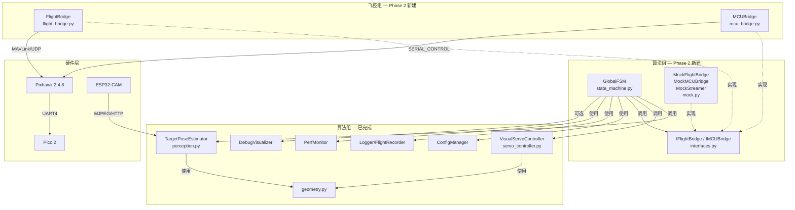

# Phase 2 协作开发规范 — FSM 状态机与模块接口契约

> 编制时间：2026-04-11 ｜ 状态：**待双方确认**
> 参与方：算法/软件组（以下简称 **算法组**） & 飞控组
> 定位：本文件作为 Phase 2 开发的**共享契约文档**，明确双方各自需要开发的模块、接口设计、调用关系和依赖关系，供各自的开发 AI 和成员参考，避免开发冲突。

---

## 一、 总体架构：决策层 + 执行层 分层解耦

### 1.1 架构全景

系统采用 **决策-执行双层架构**，算法组负责上层决策逻辑，飞控组负责下层硬件执行：

```
                        ┌──────────────────────────────────────────────┐
                        │          主入口 main.py（协作编写）           │
                        └────────────────────┬─────────────────────────┘
                                             │ 实例化 & 启动
         ┌───────────────────────────────────┼──────────────────────────────┐
         │                                   │                              │
         │     ◆ 决策层 — 算法组负责 ◆        │                              │
         │                                   │                              │
         │  ┌────────────┐  ┌─────────────┐  │  ┌────────────────────────┐  │
         │  │M2 Perception│─▶│M3 ServoCtrl │──┼─▶│  M5 GlobalFSM          │  │
         │  │(已完成)     │  │(已完成)     │  │  │  (Phase 2 核心)         │  │
         │  └────────────┘  └─────────────┘  │  └───────────┬────────────┘  │
         │                                   │              │               │
         │  ┌────────────┐                   │              │               │
         │  │MockStreamer │───────────────────┼──────────────┤               │
         │  │(Phase 2)   │                   │              │               │
         │  └────────────┘                   │              │               │
         │                                   │   高级语义指令│               │
         ├───────────────────────────────────┼──────────────┼───────────────┤
         │                                   │              ▼               │
         │     ◆ 执行层 — 飞控组负责 ◆        │                              │
         │                                   │                              │
         │  ┌──────────────────────────────────────────────────────────┐    │
         │  │  FlightBridge                                            │    │
         │  │  • send_body_velocity(vx, vy, vz, yaw_rate)             │    │
         │  │  • arm_and_takeoff(target_alt) / land()                  │    │
         │  │  • set_mode(GUIDED / LOITER / RTL)                       │    │
         │  │  • get_telemetry() → {alt, armed, mode, battery, ...}    │    │
         │  └──────────────────────────────────────────────────────────┘    │
         │  ┌──────────────────────────────────────────────────────────┐    │
         │  │  MCUBridge                                               │    │
         │  │  • send_command("START_GRAB" / "START_RELEASE" / "RESET")│    │
         │  │  • get_latest_response() → str | None                    │    │
         │  └──────────────────────────────────────────────────────────┘    │
         │                                   │                              │
         └───────────────────────────────────┼──────────────────────────────┘
                                             │
                               ┌─────────────┼──────────────┐
                               ▼             ▼              ▼
                          [Pixhawk]     [Pico 2]      [ESP32-CAM]
                          MAVLink/UDP   Serial隧道     MJPEG/HTTP
```

### 1.2 核心原则

1. **算法组只做「决策」**：状态机决定"什么时候做什么"，通过调用 `FlightBridge` / `MCUBridge` 的高级接口下达指令，**不直接构造 MAVLink 报文**
2. **飞控组只做「执行」**：把高级语义指令翻译为底层协议（MAVLink / 串口隧道），处理硬件异常和通信重连
3. **通过抽象接口解耦**：双方通过 `core/interfaces.py` 中定义的抽象基类编程，Phase 2 算法组使用 Mock 替身测试，Phase 3 替换为飞控组的真实实现

---

## 二、 模块职责总览

### 2.1 全部模块清单与归属

| 文件路径 | 模块/类名 | 负责方 | Phase 2 状态 | 说明 |
|:---|:---|:---:|:---:|:---|
| `core/interfaces.py` | `IFlightBridge`, `IMCUBridge` | **算法组** | 🆕 新建 | 抽象接口基类，双方共同遵守的契约 |
| `core/state_machine.py` | `GlobalFSM`, `FlightState` | **算法组** | 🆕 新建 | M5 全局状态机调度 + FSM 状态枚举 |
| `core/perception.py` | `TargetPoseEstimator` | **算法组** | ✅ 已完成 | M2 YOLO-OBB 推理 + 位姿提取 |
| `core/servo_controller.py` | `VisualServoController` | **算法组** | ✅ 已完成 | M3 PD 视觉伺服控制律 |
| `utils/mock.py` | `MockStreamer`, `MockFlightBridge`, `MockMCUBridge` | **算法组** | 🆕 新建 | Mock 替身，桌面全链路联调 |
| `core/flight_bridge.py` | `FlightBridge(IFlightBridge)` | **飞控组** | 🆕 新建 | MAVLink 通信封装 + 飞行控制 |
| `core/mcu_bridge.py` | `MCUBridge(IMCUBridge)` | **飞控组** | 🆕 新建 | MCU 串口隧道通信 + 红外反馈 |
| `main.py` | 主入口 | **协作** | 🆕 新建 | 实例化所有模块并启动主循环 |

> **关于原 `core/mavlink_commander.py`（M4）**：原计划由算法组编写，现与 `flight_bridge.py` 合并，统一由飞控组维护。原文件暂保留但不再使用。

### 2.2 已完成模块（Phase 0-1，算法组）

以下模块已在 Phase 0-1 完成，Phase 2 中仅作为依赖被调用，不需修改：

| 文件 | 类/函数 | 说明 |
|:---|:---|:---|
| `utils/config_manager.py` | `ConfigManager` | YAML 配置加载、点号嵌套访问、CLI 覆盖、热重载 |
| `utils/logger.py` | `setup_logger()`, `FlightRecorder` | 分级彩色日志 + CSV 飞行黑匣子 |
| `utils/perf_monitor.py` | `PerfMonitor` | 上下文管理器测量各阶段耗时，滑动窗口统计 |
| `utils/geometry.py` | `normalize_obb_angle()`, `pixel_to_body_error()`, `apply_deadband()`, `clamp()` | 角度归一化、坐标映射、死区、限幅 |
| `utils/visualization.py` | `DebugVisualizer` | OBB 框绘制、误差向量、HUD 仪表叠绘、视频录制 |
| `config/default.yaml` | — | 全局默认参数 |

---

## 三、 统一 FSM 状态枚举

### 3.1 状态定义

双方必须使用以下统一的状态枚举（定义在 `core/state_machine.py` 中，由算法组编写）：

```python
from enum import Enum

class FlightState(Enum):
    """
    全局有限状态机（FSM）状态枚举。

    状态值使用分段编号：
        0-9   系统阶段
        10-19 取货流程
        20-29 转运/投递流程
        30-39 返航/循环
        90+   异常/安全
    """
    # ─── 系统阶段 ───
    IDLE                = 0    # 系统空闲，等待启动指令
    RESET               = 1    # 系统自检 + 舵机复位

    # ─── 取货流程 ───
    INBOUND             = 10   # 解锁起飞 + 飞往取货区上方
    TASK_REC_ALIGN      = 11   # 视觉伺服对准取货区 (target_cls_id=0, pickup_zone)
    TASK_REC_DESCEND    = 12   # 盲降到取货区（维持平面纠偏 + 注入下降速度）
    TASK_REC_WAIT_LOAD  = 13   # 悬停等待人工装填 + 红外确认装填完成

    # ─── 转运 & 投递流程 ───
    TRANS_DELIVERY      = 20   # 二次起飞 + 定距转移飞往投递区（视觉/PD 不工作）
    TASK_REL_ALIGN      = 21   # 视觉伺服对准投递区 (target_cls_id=1, delivery_zone)
    TASK_REL_DESCEND    = 22   # 盲降到投递区
    TASK_REL_RELEASE    = 23   # 舵机释放货物 + 红外校验释放成功

    # ─── 返航/循环 ───
    TRANS_CARGO         = 30   # 起飞 + 飞往下一个取货区
    OUTBOUND            = 31   # 最终返航降落 + 停桨

    # ─── 异常/安全 ───
    EMERGENCY           = 90   # 紧急状态（Failsafe 触发后的统一兜底）
```

### 3.2 状态 ↔ 飞控组原命名对照

| 本项目统一状态 | 飞控组原 prompt 中的状态 | 语义说明 |
|:---|:---|:---|
| `IDLE` | `STARTUP/IDLE` | 系统自检，建立连接 |
| `RESET` | （无直接对应） | 舵机复位 |
| `INBOUND` | `TAKEOFF_HOME` | 解锁并起飞到任务高度 |
| `TASK_REC_ALIGN` | `VISION_GUIDE_TO_CARGO` | 接收视觉模型 `(vx, vy, yaw)` 引导至取货区 |
| `TASK_REC_DESCEND` | `AUTO_LAND_AT_CARGO` | 降落到取货区 |
| `TASK_REC_WAIT_LOAD` | `MCU_GRAB_SYNC` | 发送 `START_GRAB`，等待 `GRAB_DONE` |
| `TRANS_DELIVERY` | `TAKEOFF_AFTER_GRAB` | 二次起飞 + 定距转移 |
| `TASK_REL_ALIGN` | `VISION_GUIDE_TO_DELIVERY` | 接收视觉模型引导至投递区 |
| `TASK_REL_DESCEND` | `AUTO_LAND_AT_DELIVERY` | 降落到投递区 |
| `TASK_REL_RELEASE` | `MCU_RELEASE_SYNC` | 发送 `START_RELEASE`，等待 `RELEASE_DONE` |
| `TRANS_CARGO` | `TAKEOFF_FOR_RETURN` | 起飞准备下一轮 |
| `OUTBOUND` | `VISION_GUIDE_TO_HOME` + `LAND_AND_LOCK` | 返航 + 降落 + 停桨 |

### 3.3 FSM 状态流转图

```
                     启动指令
                        │
                        ▼
    ┌──────┐  自检通过  ┌───────┐  起飞成功  ┌─────────┐
    │ IDLE │──────────▶│ RESET │──────────▶│ INBOUND │
    └──────┘           └───────┘           └────┬────┘
                                                │ 到达取货区上方
                                                ▼
    ┌────────────────┐  防抖1.5s  ┌────────────────────┐
    │TASK_REC_DESCEND│◀──────────│  TASK_REC_ALIGN     │
    │                │           │  (视觉伺服 cls=0)    │
    └───────┬────────┘           └────────────────────┘
            │ 触地检测                     ▲
            ▼                              │ 目标丢失>3s: 爬升搜索
    ┌─────────────────────┐                │ 目标丢失<1s: 悬停
    │TASK_REC_WAIT_LOAD   │────────────────┘ (异常回退)
    │(等待人工装填+红外)   │
    └───────┬─────────────┘
            │ GRAB_DONE
            ▼
    ┌─────────────────┐  到达投递区  ┌────────────────────┐
    │ TRANS_DELIVERY   │──────────▶│  TASK_REL_ALIGN     │
    │ (定距转移)       │           │  (视觉伺服 cls=1)    │
    └─────────────────┘           └──────────┬───────────┘
                                             │ 防抖1.5s
                                             ▼
                                  ┌────────────────────┐
                                  │ TASK_REL_DESCEND    │
                                  └──────────┬─────────┘
                                             │ 触地检测
                                             ▼
                                  ┌────────────────────┐
                                  │ TASK_REL_RELEASE    │
                                  │ (释放+红外校验)     │
                                  └──────────┬─────────┘
                                             │ RELEASE_DONE
                              ┌──────────────┴──────────────┐
                              ▼                              ▼
                     ┌──────────────┐              ┌──────────────┐
                     │ TRANS_CARGO   │              │  OUTBOUND    │
                     │(下一轮取货)   │              │  (返航降落)   │
                     └──────┬───────┘              └──────┬───────┘
                            │                              │
                            ▼                              ▼
                     回到 TASK_REC_ALIGN              回到 IDLE
```

### 3.4 各状态对视觉/PD 控制的需求

| FSM 状态 | 视觉/PD 是否工作 | target_cls_id | 说明 |
|:---|:---:|:---:|:---|
| IDLE | 否 | — | 静置 |
| RESET | 否 | — | 自检/舵机复位 |
| INBOUND | 否 | — | 起飞/飞往取货区（定距飞行） |
| **TASK_REC_ALIGN** | **是** | **0** (pickup_zone) | **视觉伺服对准取货区** |
| **TASK_REC_DESCEND** | **是**（半速纠偏） | **0** (pickup_zone) | 维持平面纠偏 + 注入下降速度 |
| TASK_REC_WAIT_LOAD | 否 | — | 悬停等待人工装填 |
| TRANS_DELIVERY | 否 | — | 定距转移（视觉/PD 完全不工作） |
| **TASK_REL_ALIGN** | **是** | **1** (delivery_zone) | **视觉伺服对准投递区** |
| **TASK_REL_DESCEND** | **是**（半速纠偏） | **1** (delivery_zone) | 维持平面纠偏 + 注入下降速度 |
| TASK_REL_RELEASE | 否 | — | 执行释放 |
| TRANS_CARGO | 否 | — | 飞往下一个取货区 |
| OUTBOUND | 否 | — | 返航降落 |

---

## 四、 模块详细设计 — 算法组负责

### 4.1 `core/interfaces.py` — 抽象接口基类（🆕 新建）

**定位**：定义 `FlightBridge` 和 `MCUBridge` 的抽象接口，作为决策层与执行层的契约边界。算法组编写，双方共同遵守。

**文件归属**：算法组创建并维护

**依赖**：`abc`（标准库）

```python
from abc import ABC, abstractmethod


class IFlightBridge(ABC):
    """
    飞行控制抽象接口。

    由飞控组在 core/flight_bridge.py 中实现真实版本，
    由算法组在 utils/mock.py 中实现 Mock 版本。
    """

    @abstractmethod
    def connect(self) -> bool:
        """
        建立与飞控器的 MAVLink 连接，阻塞等待首个心跳包。

        Returns:
            True: 连接成功
            False: 连接超时或失败
        """
        ...

    @abstractmethod
    def arm_and_takeoff(self, target_alt: float) -> bool:
        """
        解锁电机 + 起飞到指定相对高度。

        阻塞执行，内部循环检测高度直到满足以下任一条件：
          1. 当前高度 >= target_alt * 0.95 → 返回 True
          2. 等待超时（由 config flight.takeoff_timeout_s 控制）→ 返回 False

        Args:
            target_alt: 目标高度（米），相对于起飞点

        Returns:
            True: 成功到达目标高度
            False: 超时未到达
        """
        ...

    @abstractmethod
    def send_body_velocity(
        self, vx: float, vy: float, vz: float, yaw_rate: float
    ) -> None:
        """
        发送机体坐标系速度指令。

        坐标系：MAV_FRAME_BODY_NED
            vx:       前向速度 (m/s)，正值 = 向前
            vy:       侧向速度 (m/s)，正值 = 向右
            vz:       垂直速度 (m/s)，正值 = 向下（NED 约定）
            yaw_rate: 偏航角速度 (rad/s)，正值 = 顺时针

        非阻塞，立即返回。飞控器收到后持续执行约 1 秒，
        因此需要以 ≥1Hz 的频率持续发送以保持控制。

        注意：对应 MAVLink #84 SET_POSITION_TARGET_LOCAL_NED，
             type_mask=0x07C7（纯速度接管）。
        """
        ...

    @abstractmethod
    def land(self) -> bool:
        """
        切换到 LAND 模式并等待触地。

        阻塞执行，内部循环检测直到满足以下任一条件：
          1. 飞控解除 armed 状态 → 返回 True
          2. 相对高度 < land_detect_alt → 返回 True
          3. 等待超时 → 返回 False

        Returns:
            True: 已触地
            False: 超时未触地
        """
        ...

    @abstractmethod
    def set_mode(self, mode: str) -> bool:
        """
        切换飞行模式。

        Args:
            mode: 目标模式字符串，取值范围：
                  "GUIDED" — 引导模式（接受外部速度指令）
                  "LOITER" — 定点悬停
                  "RTL"    — 自动返航

        Returns:
            True: 模式切换成功
            False: 切换失败
        """
        ...

    @abstractmethod
    def get_telemetry(self) -> dict:
        """
        获取当前飞行遥测数据（非阻塞）。

        Returns:
            {
                "armed": bool,           # 是否已解锁
                "mode": str,             # 当前飞行模式 (e.g. "GUIDED")
                "alt": float,            # 相对高度 (m)
                "heading": float,        # 航向角 (deg, 0-360)
                "battery_pct": float,    # 电池剩余百分比 (0.0~1.0)
                "heartbeat_ok": bool,    # 心跳链路是否正常
            }
        """
        ...

    @abstractmethod
    def is_connected(self) -> bool:
        """检查飞控连接是否存活（心跳未超时）。"""
        ...


class IMCUBridge(ABC):
    """
    末端执行器（Pico 2）通信抽象接口。

    由飞控组在 core/mcu_bridge.py 中实现真实版本，
    由算法组在 utils/mock.py 中实现 Mock 版本。

    通信路径：PC ←(MAVLink SERIAL_CONTROL)→ Pixhawk ←(UART4)→ Pico 2
    """

    @abstractmethod
    def send_command(self, command: str) -> bool:
        """
        向 Pico 2 发送控制指令。

        Args:
            command: 指令字符串，取值范围：
                "START_GRAB"    — 执行抓取（舵机闭合 + 红外检测）
                "START_RELEASE" — 执行释放（舵机张开 + 红外检测）
                "RESET"         — 舵机复位到初始位置

        Returns:
            True: 指令成功发送（不代表动作完成，完成需通过 get_latest_response 确认）
            False: 发送失败（链路断开等）
        """
        ...

    @abstractmethod
    def get_latest_response(self) -> str | None:
        """
        非阻塞读取 Pico 2 的最新响应。

        Returns:
            响应字符串，可能的取值：
                "GRAB_DONE"     — 抓取完成（红外确认货物已装载）
                "GRAB_FAIL"     — 抓取失败（红外确认货物未装载）
                "RELEASE_DONE"  — 释放完成（红外确认货物已脱离）
                "RELEASE_FAIL"  — 释放失败（红外确认货物未脱离）
                "RESET_DONE"    — 复位完成
            None: 暂无新响应
        """
        ...

    @abstractmethod
    def is_connected(self) -> bool:
        """检查 MCU 通信链路是否存活。"""
        ...
```

---

### 4.2 `core/state_machine.py` — 全局状态机（🆕 新建）

**定位**：M5 全局有限状态机，系统的顶层主调控中枢。

**文件归属**：算法组

**依赖关系**：

```
core/state_machine.py
├── core/interfaces.py        ← IFlightBridge, IMCUBridge (抽象接口)
├── core/perception.py        ← TargetPoseEstimator (M2, 已完成)
├── core/servo_controller.py  ← VisualServoController (M3, 已完成)
├── utils/config_manager.py   ← ConfigManager (已完成)
├── utils/logger.py           ← setup_logger, FlightRecorder (已完成)
└── utils/perf_monitor.py     ← PerfMonitor (已完成)
```

**接口设计**：

```python
import numpy as np
from core.interfaces import IFlightBridge, IMCUBridge
from core.perception import TargetPoseEstimator
from core.servo_controller import VisualServoController
from utils.config_manager import ConfigManager


class GlobalFSM:
    """
    全局有限状态机（M5）。

    职责：
      1. 根据当前 FlightState 驱动视觉Pipeline（M2→M3）或非视觉逻辑
      2. 评判状态跃迁条件（防抖跃迁 + 看门狗）
      3. 将高级语义指令下发给 FlightBridge / MCUBridge
      4. 实施异常状态的容错拦截（Failsafe）
    """

    def __init__(
        self,
        flight_bridge: IFlightBridge,
        mcu_bridge: IMCUBridge,
        perception: TargetPoseEstimator,
        controller: VisualServoController,
        config: ConfigManager,
    ) -> None:
        """
        通过依赖注入初始化所有子模块。

        Args:
            flight_bridge: 飞行控制接口（真实 or Mock）
            mcu_bridge:    MCU 通信接口（真实 or Mock）
            perception:    M2 视觉推理模块（已完成）
            controller:    M3 视觉伺服控制器（已完成）
            config:        全局配置管理器（已完成）
        """

    def tick(self, frame: np.ndarray | None) -> None:
        """
        主循环单步执行。

        由 main.py 的主循环每 tick 调用一次。
        根据当前状态执行对应逻辑：
          - 视觉阶段 → perception.process_frame() → controller.compute_velocity()
                     → flight_bridge.send_body_velocity()
          - 非视觉阶段 → mcu_bridge / flight_bridge 的对应操作

        Args:
            frame: 当前摄像头帧（RGB, H×W×3）。
                   非视觉阶段可传入 None。
        """

    @property
    def state(self) -> FlightState:
        """获取当前 FSM 状态。"""

    def request_start(self) -> None:
        """外部触发：请求从 IDLE 启动任务。"""

    def request_stop(self) -> None:
        """外部触发：请求中止任务并进入 OUTBOUND 返航。"""
```

**核心内部逻辑要点**（算法组实现参考）：

| 内部机制 | 说明 | 配置参数 |
|:---|:---|:---|
| 防抖跃迁 | 关键跃迁（ALIGN→DESCEND）需连续 T 秒满足死区条件 | `fsm.align_hold_time_s` (1.5s) |
| 目标丢失看门狗 | `<1.0s` 悬停，`>3.0s` 爬升搜索 | `fsm.target_lost_hover_s`, `fsm.target_lost_climb_s` |
| 爬升搜索 | 注入垂直速度扩大 FOV | `fsm.climb_vz` (-0.2 m/s) |
| 主循环节流 | 钳制于 10~15Hz | `fsm.tick_rate_hz` (15) |
| 日志记录 | 每次状态跃迁写 INFO 日志 + FlightRecorder 逐帧记录 | `logging.*` |

---

### 4.3 `utils/mock.py` — Mock 模拟层（🆕 新建/扩展）

**定位**：为 M1（视频流）、FlightBridge、MCUBridge 提供模拟替身，使 Phase 2 可脱硬件桌面联调。

**文件归属**：算法组

**依赖关系**：

```
utils/mock.py
├── core/interfaces.py  ← IFlightBridge, IMCUBridge
├── numpy, cv2          ← 图像处理
└── time, threading     ← 模拟延迟和异步
```

**接口设计**：

```python
class MockStreamer:
    """
    从本地视频/图片序列模拟摄像头流。
    接口与 ZeroLatencyStreamer 一致。
    """
    def __init__(self, source: str):
        """
        Args:
            source: 数据源路径
                    - 视频文件路径 (如 "test_data/flight.mp4")
                    - 图片目录路径 (如 "test_data/frames/")
        """
    def get_latest_frame(self) -> np.ndarray | None: ...


class MockFlightBridge(IFlightBridge):
    """
    飞控替身 — 模拟飞行行为，记录所有收到的指令。

    内部维护模拟状态：
      - _sim_alt: 模拟高度（起飞时递增，降落时递减）
      - _sim_armed: 解锁状态
      - _sim_mode: 飞行模式
      - command_log: 所有 send_body_velocity 调用的记录列表（供测试断言）
    """
    def __init__(self): ...
    def connect(self) -> bool: ...
    def arm_and_takeoff(self, target_alt: float) -> bool: ...
    def send_body_velocity(self, vx, vy, vz, yaw_rate) -> None: ...
    def land(self) -> bool: ...
    def set_mode(self, mode: str) -> bool: ...
    def get_telemetry(self) -> dict: ...
    def is_connected(self) -> bool: ...

    def get_command_log(self) -> list[dict]:
        """返回所有记录的指令，供测试断言检查。"""


class MockMCUBridge(IMCUBridge):
    """
    MCU 替身 — 模拟舵机/红外反馈。

    支持预编程响应序列：
        mock_mcu = MockMCUBridge()
        mock_mcu.set_auto_response("START_GRAB", "GRAB_DONE", delay_s=2.0)
        mock_mcu.set_auto_response("START_RELEASE", "RELEASE_DONE", delay_s=1.5)

    收到 send_command("START_GRAB") 后，经过 2.0s 延迟，
    下次调用 get_latest_response() 时返回 "GRAB_DONE"。
    """
    def __init__(self): ...
    def send_command(self, command: str) -> bool: ...
    def get_latest_response(self) -> str | None: ...
    def is_connected(self) -> bool: ...

    def set_auto_response(self, trigger_cmd: str, response: str, delay_s: float = 1.0) -> None:
        """预设自动响应规则。"""

    def inject_failure(self, trigger_cmd: str, failure_response: str) -> None:
        """注入异常响应（模拟装填失败/释放失败等场景）。"""

    def get_command_log(self) -> list[dict]:
        """返回所有记录的指令，供测试断言检查。"""
```

---

## 五、 模块详细设计 — 飞控组负责

### 5.1 `core/flight_bridge.py` — 飞行控制桥（🆕 新建）

**定位**：MAVLink 协议封装层，将算法组的高级语义指令翻译为底层 MAVLink 报文，经 UDP 数传链路发送给 Pixhawk 飞控。

**文件归属**：飞控组

**必须实现的接口**：`IFlightBridge`（继承自 `core/interfaces.py`）

**依赖关系**：

```
core/flight_bridge.py
├── core/interfaces.py        ← IFlightBridge (必须实现)
├── pymavlink (mavutil)       ← MAVLink 协议库
├── utils/config_manager.py   ← ConfigManager (读取配置参数)
└── utils/logger.py           ← setup_logger (日志记录)
```

**实现要点**（供飞控组参考）：

```python
from core.interfaces import IFlightBridge
from utils.config_manager import ConfigManager


class FlightBridge(IFlightBridge):
    """
    MAVLink 飞行控制桥接层。

    封装 pymavlink 底层协议细节，向上暴露语义化的飞行控制接口。
    所有 MAVLink 报文的构造和发送逻辑封装在此类内部。
    """

    def __init__(self, config: ConfigManager):
        """
        Args:
            config: 全局配置（读取 mavlink.connection, flight.* 等参数）

        需要从 config 读取的参数：
          - mavlink.connection          → UDP 连接字符串
          - mavlink.heartbeat_timeout_s → 心跳超时
          - flight.takeoff_alt          → 默认起飞高度
          - flight.arm_timeout_s        → 解锁超时
          - flight.takeoff_timeout_s    → 起飞超时
          - flight.land_detect_alt      → 触地判定高度阈值
        """

    def connect(self) -> bool: ...
    def arm_and_takeoff(self, target_alt: float) -> bool: ...
    def send_body_velocity(self, vx, vy, vz, yaw_rate) -> None: ...
    def land(self) -> bool: ...
    def set_mode(self, mode: str) -> bool: ...
    def get_telemetry(self) -> dict: ...
    def is_connected(self) -> bool: ...
```

**重要技术约束**：

| 约束 | 说明 |
|:---|:---|
| 坐标系 | `send_body_velocity` 必须使用 `MAV_FRAME_BODY_NED`（机体系，非地球系） |
| 速度报文 | 使用 `#84 SET_POSITION_TARGET_LOCAL_NED`，`type_mask=0x07C7`（纯速度接管） |
| 阻塞超时 | `arm_and_takeoff()` 和 `land()` 内部循环必须有超时退出机制，由 config 参数控制 |
| 心跳检测 | 需维护心跳时间戳，超过 `heartbeat_timeout_s` 未收到心跳时 `is_connected()` 返回 `False` |
| 线程安全 | 如果需要后台心跳监听线程，需确保 `get_telemetry()` 的线程安全 |

---

### 5.2 `core/mcu_bridge.py` — MCU 通信桥（🆕 新建）

**定位**：通过 MAVLink `SERIAL_CONTROL` 隧道，实现 PC 与 Pico 2（连接在 Pixhawk Serial 4/UART4）之间的双向通信。

**文件归属**：飞控组

**必须实现的接口**：`IMCUBridge`（继承自 `core/interfaces.py`）

**依赖关系**：

```
core/mcu_bridge.py
├── core/interfaces.py        ← IMCUBridge (必须实现)
├── pymavlink (mavutil)       ← SERIAL_CONTROL 消息
├── utils/config_manager.py   ← ConfigManager
├── utils/logger.py           ← setup_logger
└── threading                 ← 异步监听 Pico 响应
```

**实现要点**（供飞控组参考）：

```python
from core.interfaces import IMCUBridge
from utils.config_manager import ConfigManager


class MCUBridge(IMCUBridge):
    """
    末端执行器通信桥接层。

    利用 MAVLink SERIAL_CONTROL 消息在 PC 和 Pico 2 之间
    建立透传串口隧道（绕过飞控主 CPU）。

    通信路径：
        PC (本类) ←──MAVLink──→ Pixhawk ←──UART4──→ Pico 2

    协议约定（与 Pico 2 固件一致）：
        下行指令：ASCII 字符串 + '\n' 结尾
        上行响应：ASCII 字符串 + '\n' 结尾
    """

    def __init__(self, config: ConfigManager, mavlink_connection):
        """
        Args:
            config: 全局配置（读取 mcu.* 参数）
            mavlink_connection: 已建立的 MAVLink 连接
                               （通常由 FlightBridge 创建后传入，共享同一条 UDP 链路）

        需要从 config 读取的参数：
          - mcu.grab_timeout_s        → 等待抓取完成超时
          - mcu.release_timeout_s     → 等待释放完成超时
          - mcu.retry_max             → 动作失败最大重试次数
        """

    def send_command(self, command: str) -> bool: ...
    def get_latest_response(self) -> str | None: ...
    def is_connected(self) -> bool: ...
```

**重要技术约束**：

| 约束 | 说明 |
|:---|:---|
| 串口隧道协议 | 使用 MAVLink `SERIAL_CONTROL` 消息（msgid #126），device 设为 Serial 4 |
| 非阻塞读取 | `get_latest_response()` 必须为非阻塞。飞控组内部可用后台线程缓存响应 |
| 协议格式 | 指令/响应均为 ASCII + `\n`，与 Pico 2 固件侧约定一致 |
| 共享连接 | MCUBridge 与 FlightBridge 应共享同一条 MAVLink UDP 连接，避免端口冲突 |

---

## 六、 模块间调用关系与数据流

### 6.1 依赖关系图



### 6.2 运行时数据流（单个 tick）

```
┌─ GlobalFSM.tick(frame) ─────────────────────────────────────────────┐
│                                                                      │
│  1. 根据 self._state 判断是否需要视觉                                │
│     ├─ 视觉阶段 (ALIGN/DESCEND):                                    │
│     │   a. target = perception.process_frame(frame, cls_id)          │
│     │   b. 看门狗检查: target 是否为 None → 悬停/爬升                │
│     │   c. vx, vy, vyaw = controller.compute_velocity(target, ...)   │
│     │   d. flight_bridge.send_body_velocity(vx, vy, vz, vyaw)       │
│     │   e. 防抖跃迁判定 → 更新 self._state                          │
│     │                                                                │
│     └─ 非视觉阶段 (WAIT_LOAD/TRANS/RELEASE):                        │
│         a. 调用 mcu_bridge.send_command(...) 或                      │
│            flight_bridge.arm_and_takeoff(...) 等                     │
│         b. 检查 mcu_bridge.get_latest_response()                    │
│         c. 更新 self._state                                         │
│                                                                      │
│  2. flight_recorder.record({state, vx, vy, target, ...})            │
│  3. perf_monitor.measure(...)                                       │
└──────────────────────────────────────────────────────────────────────┘
```

### 6.3 模块实例化与注入（`main.py` 草案）

```python
# main.py — 主入口（协作编写）
import time
from utils.config_manager import ConfigManager
from utils.logger import setup_logger, FlightRecorder
from utils.perf_monitor import PerfMonitor
from core.perception import TargetPoseEstimator
from core.servo_controller import VisualServoController
from core.state_machine import GlobalFSM

# =====================================================
# Phase 2 使用 Mock（算法组桌面联调）
# Phase 3 替换为真实实现（飞控组提供）
# =====================================================
USE_MOCK = True  # Phase 2: True, Phase 3: False

if USE_MOCK:
    from utils.mock import MockStreamer, MockFlightBridge, MockMCUBridge
    streamer = MockStreamer("test_data/frames/")
    flight_bridge = MockFlightBridge()
    mcu_bridge = MockMCUBridge()
else:
    from core.streamer import ZeroLatencyStreamer          # Phase 3
    from core.flight_bridge import FlightBridge            # 飞控组实现
    from core.mcu_bridge import MCUBridge                  # 飞控组实现
    config = ConfigManager()
    streamer = ZeroLatencyStreamer(config.get("stream.url"))
    flight_bridge = FlightBridge(config)
    mcu_bridge = MCUBridge(config, flight_bridge._mav_conn)  # 共享 MAVLink 连接

config = ConfigManager()
perception = TargetPoseEstimator(
    weights_path=config.get("perception.weights"),
    conf_threshold=config.get("perception.conf_threshold"),
    device=config.get("perception.device"),
)
controller = VisualServoController(
    kp=[config.get("servo.pickup_align.kp.x"), config.get("servo.pickup_align.kp.y"),
        config.get("servo.pickup_align.kp.yaw")],
    kd=[config.get("servo.pickup_align.kd.x"), config.get("servo.pickup_align.kd.y"),
        config.get("servo.pickup_align.kd.yaw")],
    deadband=[config.get("servo.pickup_align.deadband.x"), config.get("servo.pickup_align.deadband.y"),
              config.get("servo.pickup_align.deadband.yaw")],
    max_vel=[config.get("servo.pickup_align.max_vel.x"), config.get("servo.pickup_align.max_vel.y"),
             config.get("servo.pickup_align.max_vel.yaw")],
)

fsm = GlobalFSM(
    flight_bridge=flight_bridge,
    mcu_bridge=mcu_bridge,
    perception=perception,
    controller=controller,
    config=config,
)

# --- 主循环 ---
tick_interval = 1.0 / config.get("fsm.tick_rate_hz", 15)
fsm.request_start()

while True:
    frame = streamer.get_latest_frame()
    fsm.tick(frame)
    time.sleep(tick_interval)
```

---

## 七、 状态跃迁判据明细

### 7.1 跃迁规则表

| # | 跃迁 | 判定方 | 触发判据 | 数据来源 |
|:---:|:---|:---:|:---|:---|
| 1 | `IDLE → RESET` | 算法组 | `request_start()` 被调用 | 操作员触发 |
| 2 | `RESET → INBOUND` | 协作 | 飞控自检通过（`get_telemetry().heartbeat_ok == True`）+ MCU 复位完成（`get_latest_response() == "RESET_DONE"`） | FlightBridge + MCUBridge |
| 3 | `INBOUND → TASK_REC_ALIGN` | 算法组 | `arm_and_takeoff()` 返回 `True`（到达预设高度） | FlightBridge |
| 4 | `TASK_REC_ALIGN → TASK_REC_DESCEND` | **算法组** | M3 输出速度 (vx, vy, vyaw) **连续 1.5s 全部为零**（防抖跃迁） | M3 + 内部计时器 |
| 5 | `TASK_REC_DESCEND → TASK_REC_WAIT_LOAD` | **协作** | `get_telemetry().alt < land_detect_alt` 或 `land()` 返回 `True` | FlightBridge |
| 6 | `TASK_REC_WAIT_LOAD → TRANS_DELIVERY` | **算法组** | `get_latest_response() == "GRAB_DONE"` | MCUBridge |
| 7 | `TRANS_DELIVERY → TASK_REL_ALIGN` | 算法组 | 二次起飞成功 + 定距转移完成（基于时间/距离判定） | FlightBridge |
| 8 | `TASK_REL_ALIGN → TASK_REL_DESCEND` | **算法组** | 同 #4，M3 连续 1.5s 速度为零 | M3 + 内部计时器 |
| 9 | `TASK_REL_DESCEND → TASK_REL_RELEASE` | **协作** | 同 #5，触地检测 | FlightBridge |
| 10 | `TASK_REL_RELEASE → TRANS_CARGO 或 OUTBOUND` | **算法组** | `get_latest_response() == "RELEASE_DONE"` + 是否还有下一轮 | MCUBridge |
| 11 | `TRANS_CARGO → TASK_REC_ALIGN` | 算法组 | 起飞 + 飞达下一取货区上方 | FlightBridge |
| 12 | `OUTBOUND → IDLE` | 算法组 | 返航降落完成（`land()` 返回 `True`） | FlightBridge |

### 7.2 异常跃迁（Failsafe）

| 异常场景 | 检测方 | 处理 | 目标状态 |
|:---|:---:|:---|:---:|
| 目标丢失 < 1.0s | 算法组 | 截断 M3，全零速悬停 | 保持当前状态 |
| 目标丢失 > 3.0s | 算法组 | 爬升搜索（Vz = climb_vz） | 保持当前状态 |
| MCU 响应超时 | 算法组 | 重试最多 N 次 → 失败则 EMERGENCY | `EMERGENCY` |
| 飞控心跳丢失 | 飞控组 | 飞控内建 Failsafe（RTL/LAND） | `EMERGENCY` |
| 电池低压 | 飞控组 | 飞控内建保护 → 强制降落 | `EMERGENCY` |
| RC 接管 | 飞控组 | 飞控层面切换到手动模式 | （FSM 暂停） |

### 7.3 失败重试机制

对于 `TASK_REC_WAIT_LOAD` 和 `TASK_REL_RELEASE` 阶段：

```
发送指令 → 等待响应 → 超时或收到 xxx_FAIL
                          │
                          ▼
                    retry_count < retry_max ?
                    ├─ 是 → 重新发送指令，retry_count++
                    └─ 否 → 跃迁至 EMERGENCY
```

重试参数由 `config/default.yaml` 中 `mcu.retry_max` 控制（默认 2 次）。

---

## 八、 安全逻辑分层

```
┌─ 层级 1：算法层安全（算法组 FSM 内部实现） ────────────────────────┐
│                                                                     │
│  • 目标丢失看门狗（<1s 悬停，>3s 爬升搜索）                         │
│  • 防抖跃迁（连续 1.5s 满足死区条件才触发关键跃迁）                  │
│  • 状态超时保护（任何状态超过 N 秒未跃迁 → EMERGENCY）               │
│  • MCU 响应超时重试 + 失败兜底                                      │
│                                                                     │
│  实现位置：core/state_machine.py 内部逻辑                           │
└─────────────────────────────────────────────────────────────────────┘
                                ▼
┌─ 层级 2：飞控层安全（飞控组 FlightBridge / Pixhawk 参数配置） ──────┐
│                                                                     │
│  • 心跳丢失保护（数传断连 → 悬停 5s → RTL）                         │
│  • 电池低压保护（电压过低 → 强制降落）                               │
│  • Geofence（超出预定区域 → RTL）                                   │
│  • 飞控内建 Failsafe（FS_THR_ENABLE, FS_GCS_ENABLE 等参数）        │
│  • get_telemetry() 中暴露异常标志，供算法层感知                      │
│                                                                     │
│  实现位置：core/flight_bridge.py + Pixhawk Mission Planner 配置     │
└─────────────────────────────────────────────────────────────────────┘
                                ▼
┌─ 层级 3：物理层安全（硬件兜底，无需软件实现） ─────────────────────┐
│                                                                     │
│  • RC 遥控最高权限接管（物理开关覆盖所有软件指令）                    │
│  • 叉式机构"掉电保护"（断电时货物不脱落，物理设计保证）              │
│                                                                     │
└─────────────────────────────────────────────────────────────────────┘
```

**关键约定**：
- 当飞控层 Failsafe 被触发（如 RTL），`FlightBridge.get_telemetry()` 中 `mode` 字段会变为 `"RTL"` 或 `"LAND"`，算法组的 FSM 检测到后应立即跃迁至 `EMERGENCY` 状态，停止下发速度指令
- 算法层的"爬升搜索"行为（目标丢失 > 3s）**不应**与飞控的 Geofence 或 RTL 冲突。建议设置爬升上限高度

---

## 九、 需要新增的配置参数

以下配置段需添加到 `config/default.yaml`（算法组操作，飞控组确认参数值）：

```yaml
# ======== 飞行控制（FlightBridge 使用） ========
flight:
  takeoff_alt: 1.5              # 默认任务高度 (m)
  land_detect_alt: 0.15         # 触地判定高度阈值 (m)
  arm_timeout_s: 10             # 解锁等待超时 (s)
  takeoff_timeout_s: 15         # 起飞等待超时 (s)
  land_timeout_s: 20            # 降落等待超时 (s)

# ======== MCU 通信（MCUBridge 使用） ========
mcu:
  grab_timeout_s: 10            # 等待 GRAB_DONE 响应超时 (s)
  release_timeout_s: 10         # 等待 RELEASE_DONE 响应超时 (s)
  retry_max: 2                  # 动作失败最大重试次数

# ======== 定距转移 ========
transfer:
  delivery_distance_m: 3.0      # 取货区到投递区预设距离 (m)
  transfer_speed: 0.3           # 转移飞行速度 (m/s)
  transfer_alt: 1.5             # 转移飞行高度 (m)
  transfer_heading_deg: 0       # 转移飞行航向 (deg)，待实测确定
```

---

## 十、 文件目录变更总结

### Phase 2 新增文件

```
drone_gcs/
├── core/
│   ├── interfaces.py          # [新建] 算法组 — 抽象接口基类
│   ├── state_machine.py       # [新建] 算法组 — GlobalFSM + FlightState 枚举
│   ├── flight_bridge.py       # [新建] 飞控组 — MAVLink 飞行控制
│   └── mcu_bridge.py          # [新建] 飞控组 — MCU 串口隧道通信
├── utils/
│   └── mock.py                # [新建] 算法组 — MockStreamer/FlightBridge/MCUBridge
├── main.py                    # [新建] 协作 — 主入口
└── docs/
    └── fsm_state.md           # [新建] 本文件 — 协作契约文档
```

### 开发时序依赖

```
  core/interfaces.py (算法组先行编写)
       │
       ├──────────────────────────────────┐
       ▼                                  ▼
  utils/mock.py (算法组)          core/flight_bridge.py (飞控组)
  core/state_machine.py (算法组)  core/mcu_bridge.py (飞控组)
       │                                  │
       ├──────────────────────────────────┤
       ▼                                  ▼
  桌面 Mock 联调 (算法组)           飞控单体测试 (飞控组)
       │                                  │
       └──────────────┬───────────────────┘
                      ▼
               main.py 集成联调 (协作)
```

> **关键路径**：`core/interfaces.py` 是双方的前置依赖，应**最先完成**并双方确认后冻结。

---

## 十一、 待双方确认的事项清单

> ⬜ = 待确认 ｜ ✅ = 已确认

| # | 确认事项 | 状态 |
|:---:|:---|:---:|
| 1 | FSM 状态枚举定义（第三节） | ⬜ |
| 2 | `IFlightBridge` 接口签名（第四节 4.1） | ⬜ |
| 3 | `IMCUBridge` 接口签名（第四节 4.1） | ⬜ |
| 4 | `FlightBridge` 实现约束（第五节 5.1） | ⬜ |
| 5 | `MCUBridge` 实现约束（第五节 5.2） | ⬜ |
| 6 | 状态跃迁判据表（第七节） | ⬜ |
| 7 | 安全逻辑分层（第八节） | ⬜ |
| 8 | `config/default.yaml` 新增参数值（第九节） | ⬜ |
| 9 | `FlightBridge` 与 `MCUBridge` 共享 MAVLink 连接的方式 | ⬜ |
| 10 | 代码分支策略（算法组 `feature/phase2-fsm`，飞控组 `feature/flight-bridge`） | ⬜ |
